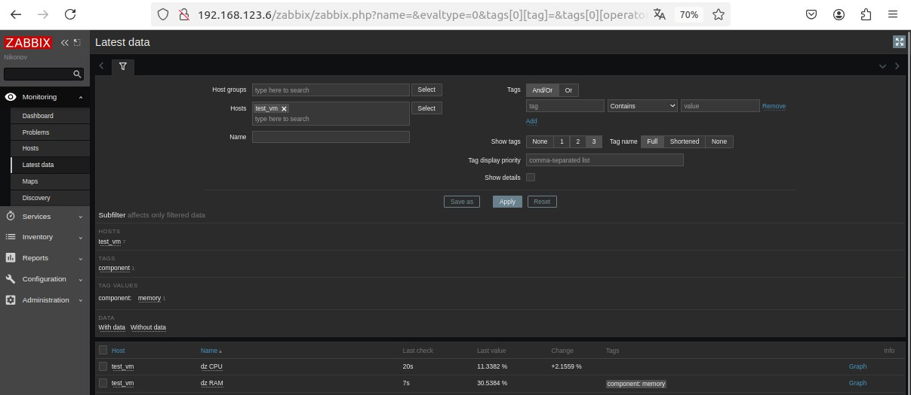
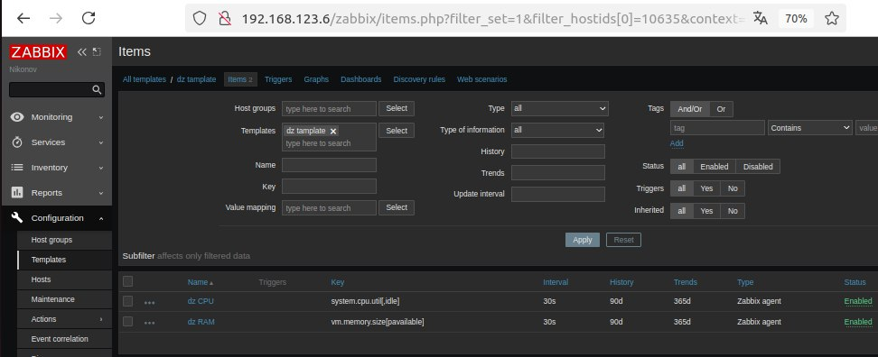
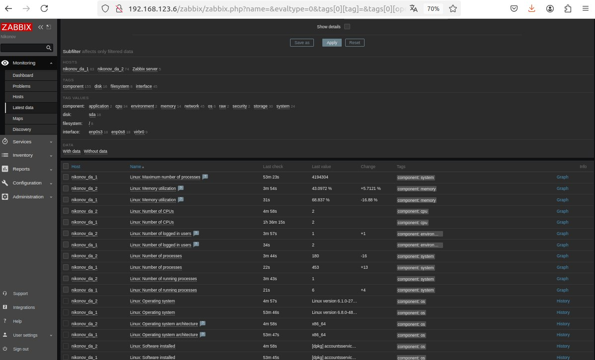
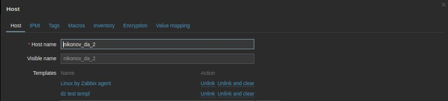
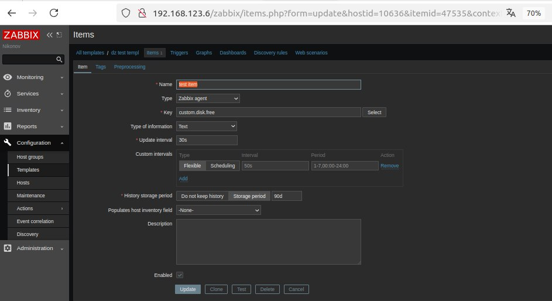
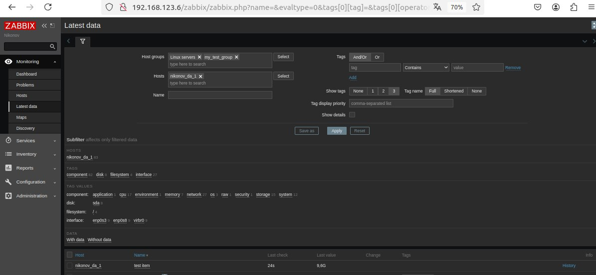
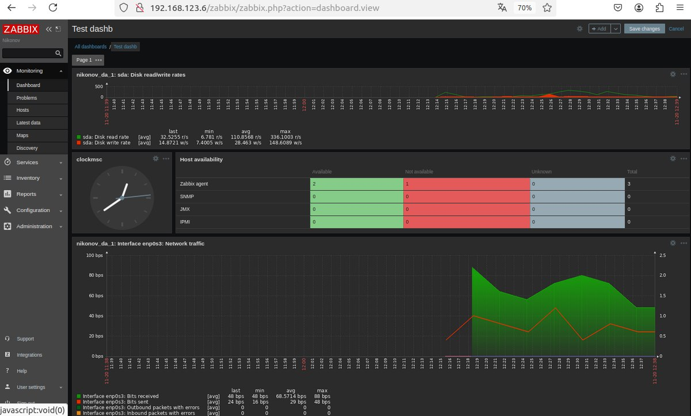

# Домашнее задание к занятию "`Zabbix part2`" - `Nikonov Danila`

### Задание 1

---

### Задание 2

`Требования к результату`
`Результат данного задания сдавайте вместе с заданием 3`

---

### Задание 3

---

### Задание 4

---
